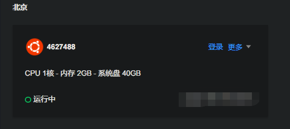
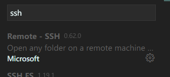
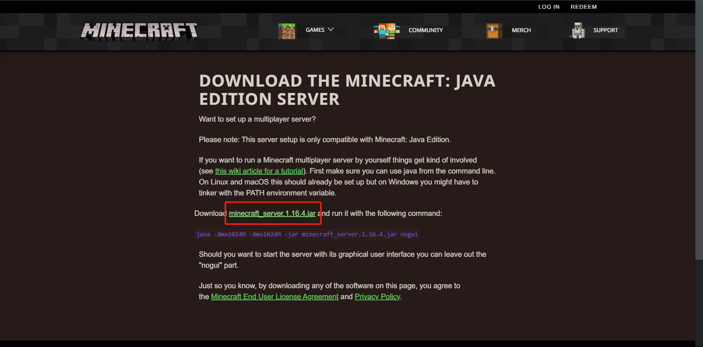
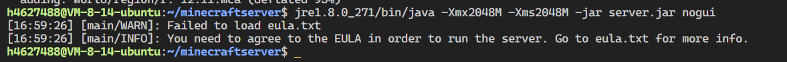

期末后我校上了四天网课，于是就有了这篇博客。
这篇博客只针对云服务器开服教程，实际上你可以通过端口映射实现联机，但是服务器可以 24 小时在线。

## 0x00 食用前你需要

- 一个实名注册的云服务供应商的账号（阿里云，腾讯云之类的）
- 买一个云主机/轻量应用服务器

## 0x01 构建

我服务器端使用的系统是 Ubuntu 20.04 LTS


首先用 SSH 连上服务器，vscode 操作比较方便，在 vscode 扩展商店里找到 Remote-SSH，安装



左下角 SSH 连接到你的服务器，连接好之后打开一个文件夹作服务器文件夹

从[这里](https://www.minecraft.net/en-us/download/server)下载 Minecraft Server 核心(现在是 1.16.4)
<https://imgse.com/i/sQSPjU>


把`server.jar`复制到服务器的文件夹里

从[这里](https://www.java.com/zh-CN/download/manual.jsp)下载在服务器上的 jre.解压复制到`server.jar`的目录里。

把 下载到的 java 的文件夹名改成“jre“，打开 bash
运行

```bash
jre/bin/java -Xmx1024M -Xms1024M -jar server.jar nogui
```

然后得到这个结果


你需要打开 `eula.txt` ，把其中的

```
eula=false
```

改成

```
eula=true
```

再运行一遍，出现

```shell
[17:04:12] [Server thread/INFO]: Time elapsed: 2863 ms
[17:04:12] [Server thread/INFO]: Done (3.028s)! For help, type "help"
```

表明服务器开成功了。
在客户端输入服务器的 ip 就可以登入

## 0x02 设置

文件夹下已经出现 `server.properties` 文件

- `pvp=true` :是否可以伤害其他玩家
- `white-list=false` :启用白名单
- `online-mode=true` :使用正版认证
- `motd=` :服务器的说明
- `enable-command-block=true` :允许使用命令方块

存档保存在 `world` 下。

## 0x03 存档自动备份&&崩溃自动重启

把这个保存成 start.sh(Ubuntu)

```shell
#!/bin/bash
cut=0
ret=0
myFile="stop"
while [ ! -f "$myFile" ]
do
    let cut++
    jre/bin/java -Xmx2048M -Xms2048M -jar fabric-server-launch.jar nogui
    OP_MODE=$?
    if [ "$OP_MODE" -eq "0" ];then
        break
    fi
    filename="backup_`date +%y%m%d%H%M%S`.zip"
    zip -r backup/$filename world/
done
```

之后通过 `.\start.sh`
运行服务器，这样每次崩溃之后服务器就会备份重开。

## 0x3f 后记

本来打算和别人联机玩，结果折腾服务器无法自拔，另外两个大佬自己玩的 φ(≧ω≦\*)♪
