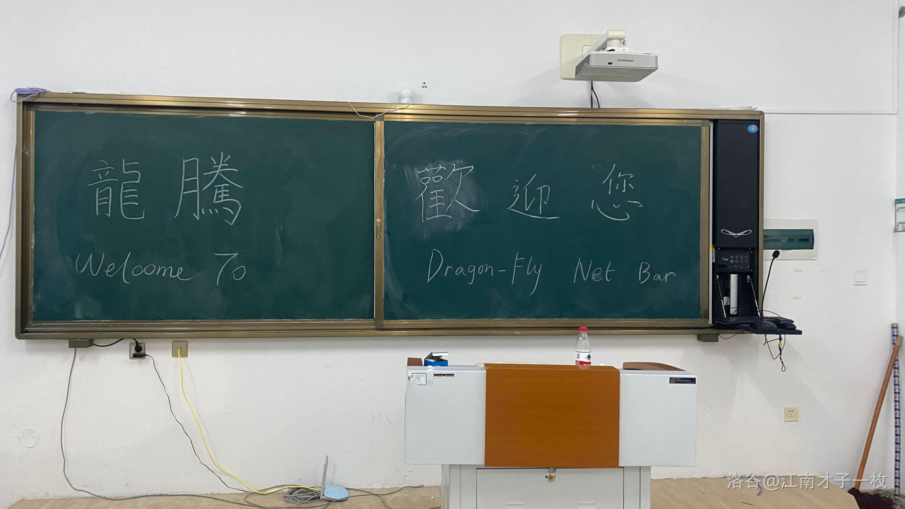

## day -1 : 12 月 3 日

机房最后一天集训了，依照教练指示，大家开始收拾机房。收拾的时候，大家的情绪不免有些低落，毕竟是最后一天了，之后，这个被称为“龙腾网吧”的机房就会迎来半年的平静。

从 8 月末我来到实验中学开始，我来龙腾近 100 天。在这一百天里，我感受到了机房的愉悦气氛，lkw 的三分法 AC，
zzj 随机数过 80pts，~~ysy 多得 90pts 的小技巧，~~ 机房承载了许多的欢声笑语的回忆。

~~收拾的时候，我发现键盘缝里好多头发。~~

最后 Cola 在黑板上写了“龙腾欢迎您”，ljl 开始删他的 lol
，我 `sudo rm -rf *` 了我的电脑（十一集训事件），完成了和龙腾 510 的告别。

## day 0 : 12 月 4 日

由于 HL 会考，我们高一在这天得以放一下午的假，而我们要出征 noip2020 了。
下午回家打了线段树模板，又看了一些模板，期望能压中一个。
晚上到了哈尔滨，我发现我们 8 个人只有 4 个住我住的酒店。在酒店里，我又打了打智颓上的题目，其他人都到了我的房间，~~都是男的我害怕啊~~，堪称龙腾 320。

ljl 打他的 LOL，后来回去了，我和 zzj 切题切到零点。总担心 noip 不出阳间题，后来也难以入睡，就开始想儒略历的做法。(ptsd)

## day 1 : 12 月 5 日

## 赛前

早上 5 点就起来了，心里全是格里高利和他的历法。

很快找到了考点，考试很快开始了。

## 赛时

T1 一看，啊，原来是 DAG。我一个拓扑排序，就打上去了，很快啊，分数也好维护，~~T1 出题人真谢谢你~~，啊这高精我是真没想到。

T2 牢记儒略历教训，太长题面直接看后面题，别浪费时间（结果这是最好暴力的）

T4 求进行一套走位后的最终位移，再求每套最远走到的区间，然后判断是否在一套内。轻松骗到 35pts。其他的不会了。

T3 那一天，ccf 终于会出一道 spj 的。暴力做法：模拟每个栈，从第一个栈开始，以最底下的颜色为这个栈的颜色，把其他栈凡是有的全抢过来，无用的随便放。样例 4 直接超 81w。

## 赛后

赛后发现分数加法的临时变量用的`int`

赛后听说 t1 要高精，我直接傻了。

洛谷自测发现 t1 那个`int` 90pts -> 70pts

upd 12.8 :ccf 数据给我判了 60pts，是没开高精度的分

弱省 rank 20
